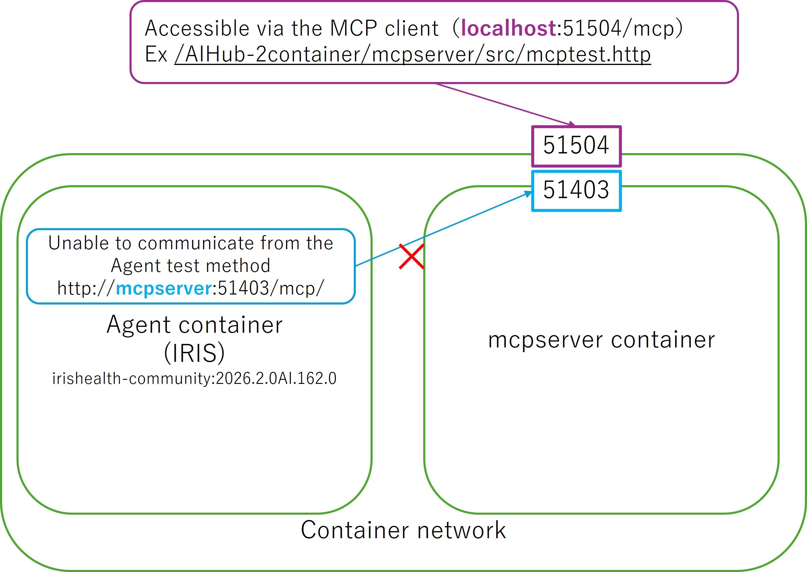

# How to Run the Test

1. Enter the API key in [.env](./.env).

    The repository uses OpenAI. Please enter your API key in [.env](./.env).

2. Build and Start the containers.

    ```
    docker compose up -d
    ```

3. Run the Agent test.

    Log in to the agent container.
    ```
    docker exec -it aihub-2container-agent-1 bash
    ```
    Log in to iris
    ```
    iris session iris
    ```
    Run the test method
    ```
    do ##class(Demo.Agent.ChatTest).TestChat()
    ```
    You will receive the following error:
    ```
    USER>do ##class(Demo.Agent.ChatTest).TestChat()

        Set sc=agent.%Init() Throw:('sc) ##class(%Exception.StatusException).ThrowIf
                                        ^
    Interrupt(sc)
    <THROW>TestChat+2^Demo.Agent.ChatTest.1 *%Exception.StatusException エラー <%AICore>McpError: MCP protocol error: Failed to add tool spec 'mcp:remote:http://mcpserver:51403/mcp/': Resolver error: MCP protocol handshake failed: Send message error Transport [rmcp::transport::worker::WorkerTransport<rmcp::transport::streamable_http_client::StreamableHttpClientWorker<reqwest::async_impl::client::Client>>] error: unexpected server response: HTTP 403 Forbidden: Forbidden: Host header is not allowed, when send initia
    USER 2d1>q
    ```



4. Test the MCP Server tools from the host.

   You can use [mcptest.http](./mcpserver/src/mcptest.http) to send a request to the MCP server.

   The request works correctly because it can use the hostname "localhost".